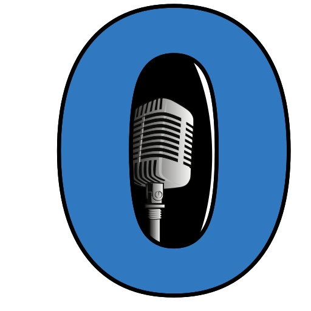

# Voice-Zero

This is a collection of open source compatible voice samples mostly from public domain and Creative Commons works, which are suitable for use with zero-shot text to speech engines.

The primary goal of this repository is to provide high quality voice samples that are ready to use, as-is, with zero-shot TTS engines like [Chatterbox](https://github.com/resemble-ai/chatterbox) and [Pocket TTS](https://github.com/kyutai-labs/pocket-tts).

The secondary goal is to provide a very clear trail from the final voice samples all the way back to not only the voice actor, but the original source files, for the sake of giving credit where credit is due.  That's not always possible, because some voice datasets seem to be anonymized, or have not been tracked very well, but whenever it can be done, that data will be provided.

A variety of tools were used to clean up the source data as much as possible, including the following:

* [Audacity](https://www.audacityteam.org/)
	- The built-in noise remover can be handy
	- Very rarely, this is also used to make slight speed changes
		+ Via tempo changes
* [Kanade Tokenizer](https://github.com/frothywater/kanade-tokenizer)
	- Amazing tool that operates in two modes:
		+ Voice Conversion
		+ Voice Resynthesis
			* This analyzes the voice, producing an ideal, noise-free version
			* That is then used to voice-convert the original sample, removing noise, which even works on reverb!
		+ It's extremely fast, especially compared to the [Chatterbox](https://github.com/resemble-ai/chatterbox) voice converter
* [SoX](https://en.wikipedia.org/wiki/SoX)
	- Involved in scripting the other tools, mostly for on the fly format conversion
* [Resemble Enhance](https://github.com/resemble-ai/resemble-enhance)
	- AI noise remover and audio up-scaler
	- This is used as the final step for each voice sample
	- It does a good job removing the noise [Chatterbox](https://github.com/resemble-ai/chatterbox) tends to introduce
* [RNNoise](https://github.com/xiph/rnnoise)
	- AI noise remover
	- Works quite well with VAD% set to 99
		+ The default of 50% is terribly ridiculous

## Notes on Directories

The [voices directory](voices) holds audio samples from [LibriVox.org](https://librivox.org), which have been noise reduced and trimmed to between seven and roughly twelve seconds, a length that works well for zero-shot TTS engines.  This directory will *always* hold [CC0-licensed](https://creativecommons.org/public-domain/cc0/) samples.

The [voices-emotion directory](voices-emotion) holds synthetic audio samples produced by using [voices directory](voices) with [Chatterbox](https://github.com/resemble-ai/chatterbox), to produce emotional variations.

If there are ever samples under other licenses, they will be placed in other directories, to keep the licensing issues clear and easy to work with.

## License

Unless otherwise noted, all files in this repository are under the [CC0 license](https://creativecommons.org/public-domain/cc0/).  Currently, everything is based on samples from [LibriVox.org](https://librivox.org/).

For more specific details, please examine the `README.md` files in each subdirectory, which will also provide the names of the voice actors and links to the original sources.
